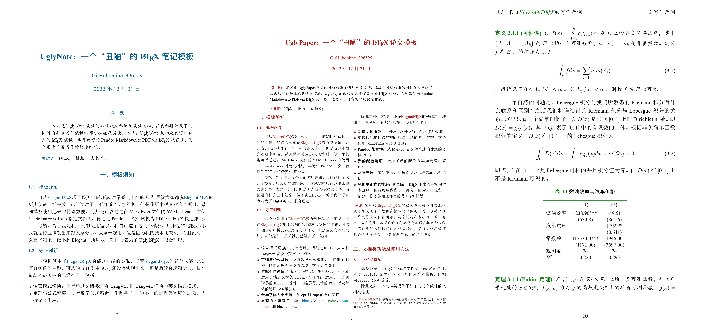

# Ugly\LaTeX：系列 \LaTeX 文档类

## 项目简介

自从 [Elegant\LaTeX](https://github.com/ElegantLaTeX/) 项目停更之后，我就时常感到十分的无措。尽管大家都说 [Elegant\LaTeX](https://github.com/ElegantLaTeX/) 的历史使命已经完成、已经过时了，不在适合继续维护，但是我本来是很喜欢这个项目的。系列模板使用起来也特别方便，尤其是可以通过在 Markdwon 文件的 YAML Header 中使用 `documentclass` 指定文档类，再通过 Pandoc 一次性转换为 PDF via \LaTeX 快速排版。

最初，为了满足我个人的使用需求，我自己搓了这几个模板。后来觉得比较好用，我就觉得应该发出来跟大家分享，大家一起用。但是因为我的技术比较菜，而且没有什么艺术细胞，做不到 Elegant，只能做到 Ugly，所以我把项目命名为了 Ugly\LaTeX ，很合理吧。

本项目旨在 **直接生成效果理想的排版文档**，因为我想简化流程，直接生成想要的文档格式，无需在正式编写文档的时候再去调整。[Elegant\LaTeX](https://github.com/ElegantLaTeX/) 曾经经常被认为是将各种功能模块写得太死了，想要在排版的时候进行进一步的个性化格式修改就会很困难。这个问题在本项目中非但有之，而且更甚。总之，本项目的理念就是要确保在排版的过程中不需要引入任何额外的样式修改，直接提供足够理想的终产物样式，并适配尽可能广的应用场景。

**到目前为止，本项目作为一个文档类已经可以很好地使用了，但是作为一个项目，还有很多不完善的地方。比如文档还不够齐全、代码格式和注释不严谨等。** 因此，本项目将在未来持续更新和完善，望各位用户能够持续跟进，或者参与本项目的开发。

## 排版效果展示

本项目总共包含三个模板类：

- **UglyNote**：用于轻量化、便捷地编写常见的笔记、博客等。
- **UglyPaper**：比 UglyNote 更紧凑的布局，适合编写更加正式的文档。
- **UglyRep**：带有封面和摘要的报告，适用于更长和更正式的写作场景。

三个文档类各自的排版效果展示如下图所示。



## 文档类安装

将文档类安装到计算机可以允许您在计算机上的任何位置调用本文档类进行写作，这对于快速编排文档，尤其是与 Pandoc 协同编写文档尤其有帮助。本文档类有 2 种安装方法：

1. 使用 Makefile 进行自动安装；
2. 手动安装到计算机目录。

### 使用 Makefile 进行自动安装

#### 确定安装位置

在安装文档类之前，您需要先确定合适的安装位置。通常，LaTeX 使用 `TEXMF` 目录组织所有宏包、类文件和字体资源。可用的 `TEXMF` 目录在不同的操作系统和不同的 \LaTeX 发行版上可能会有所不同。

**A. 对于 MiK\TeX 用户**：MiK\TeX 上的 `TEXMF` 目录有 6 个，功能各不相同，分别是：

- **UserConfig**：用于用户特定的配置文件；
- **UserData**：用于用户特定的数据文件（格式文件、字体缓存等）；
- **UserInstall**：用户安装的软件包的安装目标；
- **CommonConfig**：用于共享（系统范围）配置文件；
- **CommonData**：用于共享（系统范围）数据文件（格式文件、字体缓存等）；
- **CommonInstall**：MiKTeX管理员安装的软件包的安装目标。

在不同的操作系统上，各个目录的具体位置请自行参考参考官方文档 [TEXMF root directories](https://miktex.org/kb/texmf-roots) 中的说明，此处不再赘述。您也可以启动 MiK\TeX Console，打开“设置”，选择“目录”选项卡，从而将任何目录设置为全局的 `TEXMF` 目录。如果您以管理员用户身份添加该目录，则该目录可以被计算机上所有用户访问；否则，该目录只能由当前用户访问。

**B. 对于 \TeX Live 用户**： \TeX Live 上可用的 `TEXMF` 目录通常包含三个：

1. **以年份命名的版本号目录**：位于安装目录 `texlive` 下的形如 `2023`、`2024` 这样的目录名[^1]。保存的是 `texlive` 内置的宏包文件。不建议安装到此位置。
2. **本地用户自定义安装的宏包文件目录**：只能被当前用户访问，在 Windows 和 Linux/MacOS 上有所不同，一般情况下： 
  - **Linux/macOS**: `~/texmf`
  - **Windows**: `%USERPROFILE%\texmf`
3. **全局用户自定义安装的宏包文件目录**：能够被所有用户访问，如果您在 Linux/MacOS 上使用 \TeX Live，则该路径可能是 `/usr/local/texlive/texmf-local`；如果您在 Windows 上使用 \TeX Live，比如，如果您安装了 \TeX Live 2023，则在您的 \TeX Live 安装目录下会存在一个 `texmf-local` 目录。**推荐安装到此位置**。

您可以使用如下命令查询安装目录：

```bash {.numberLines}
# 查询本地用户的安装目录
kpsewhich -var-value TEXMFHOME
# 查询全局安装目录
kpsewhich -var-value TEXMFLOCAL
```

如果您不确定安装到哪个目录，则建议您安装到 `TEXMFLOCAL` 目录。

#### 指定安装目录

在确定安装目录之后，您需要在 `config.mk` 中指定此目录。您需要编辑 `TEXMF` 变量，使其指向您指定的目录。`config.mk` 中的注释写得比较详细，可以作为参考。这里列举一些安装目录指定的操作方法：

对于 Windows 用户，假如您的 \TeX Live 安装在系统的 `D:\texlive` 目录下，则你可以在该目录下找到名为 `texmf-local` 的目录。要将本文档类安装到该目录下，您需要设置 `TEXMF` 的值为：

```makefile
TEXMF = /d/texlive/texmf-local
```

或者，如果您在 Windows 上使用 MiK\TeX，假设您创建了一个 `D:/Programs/texmf-local` 目录，并已经正确添加到了 MiK\TeX 的 `TEXMF` 列表，则可以像下面这样指定您的安装目录：

```makefile
TEXMF = /d/Programs/texmf-local
```

*Note*. 在 Windows 上运行 `make` 命令，通常情况下需要配置 GCC 工具链。常见的 POSIX 兼容层，比如 MSYS 2，使用根目录下的 `/c`、`/d` 来指定 Windows 盘符。但如果您使用的是 Cygwin，或者 WSL，则磁盘可能是被挂载在 `/mnt` 目录下。

```makefile {.numberLines}
TEXMF = /mnt/d/texlive/texmf-local
TEXMF = /mnt/d/Programs/texmf-local
```

如果您在 Linux 或者 MacOS 上使用 \TeX Live 并且希望将模板安装到本地用户的主目录：

```makefile
TEXMF = ~/texmf
```

或者，安装到 \TeX Live 的全局主目录：

```makefile
TEXMF = /usr/local/texlive/texmf-local
```

#### 执行安装命令

在正确指定了安装目录之后，只需要执行 `make install`，模板文件将会全部被安装到您的计算机上。安装完成后，执行 `mktexlsr` 命令刷新 \TeX 的文件目录系统，从而使 \LaTeX 能够正确识别模板文件。

**注意！** 如果您在 MiK\TeX 上安装本模板，这里建议您在安装之后手动打开 MiK\TeX Console 刷新文件目录。MiK\TeX Console 的 GUI 界面在新版本中有所更新，这可能造成刷新按钮的位置有所不同，实际位置以具体版本为准。

### 手动安装

在一些情况下，比如，如果您的计算机上没有安装用以在 Windows 上执行 `make` 命令的兼容层环境，或者出于某些原因您不愿意使用自动安装的方案，您也可以手动安装本模板。具体的操作方法是：

1. 确认按安装位置：与自动安装时一样，安装位置必须是一个 `TEXMF` 目录。
2. 手动迁移文件：将 `./texmf/` 下的所有文件及目录复制黏贴到有待安装的目录下。
3. 执行 `mktexlsr` 命令刷新 \TeX 的文件目录系统，从而使 \LaTeX 能够正确识别模板文件。

### 不安装模板直接使用

如果您不希望在您的计算机上安装本模板，而是希望直接在项目目录下使用模板，则操作方法也比较简单：直接复制本项目目录下的 `texmf/tex/latex/uglulatex/` 下的所有文件到您的项目目录下，即可直接在项目文档中指定本文档类使用。

## 更多文档

如果您想查看本文档类中的更多文档，请使用如下命令，列出所有项目文档。

```bash
texdoc -l uglylatex
```

## 宏包

本文档类用到的所有宏包如下表所示。在使用本文档类之前，请您先确保这些宏包已经被正确配置。

| 1                 | 2          | 3        | 4         |
|-------------------|------------|----------|-----------|
| ifxetex           | kvoptions  | etoolbox | calc      |
| ctex              | titling    | titlesec | array     |
| hologo            | geometry   | fontsprc | float     |
| authblk           | amsmath    | amssymb  | amsthm    |
| mathtools         | mathrsfs   | cancel   | tocloft   |
| titletoc          | hyperref   | fancyhdr | enumerate |
| enumitem          | metalogo   | setspace | caption   |
| subcaption        | appendix   | graphicx | booktabs  |
| multirow          | longtable  | pdfpages | braket    |
| qcircuit          | mhchem     | chemfig  | tikz      |
| tikz-network      | circuitikz | pdfpages | braket    |
| multirow          | longtable  | pgfplots | color     |
| xcolor            | colortbl   | xpatch   | verbatim  |
| matlab-prettifier | bookmark   |          |           |


: 本文档类所使用到的宏包

## Q&A

### 在 Pandoc 中启用颜色

Pandoc 默认会将所有引用、文件链接、URL 和交叉引用设置为黑色。如果需要启用颜色格式，可以在 Markdown 文件开头的 YAML Header 中加入如下内容。

```yaml {.numberLines}
# Enable document colors.
colorlinks: true
citecolor: ecolor
filecolor: ecolor
linkcolor: ecolor
urlcolor: ecolor
```

### 在 Pandoc 中启用代码换行

Pandoc 中默认使用 `Verbatim` 环境高亮代码，过长的代码可能会超出屏幕。在 Markdown 文件开头的 YAML Header 中使用如下命令可以确保高亮的代码块启用自动换行。尽管在 \LaTeX\ 模式下已经正确定义了 `Verbatim` 环境下的自动换行，Pandoc 似乎存在某种机制会主动覆盖掉这些设置。

```yaml {.numberLines}
# Warp lines in code blocks
header-includes:
  - \usepackage{fvextra}
  - |
    \DefineVerbatimEnvironment{Highlighting}{Verbatim}{
      breaklines,commandchars=\\\{\}
    }
```

[^1]: 该数字即您安装的 \TeX Live 年份版本号。